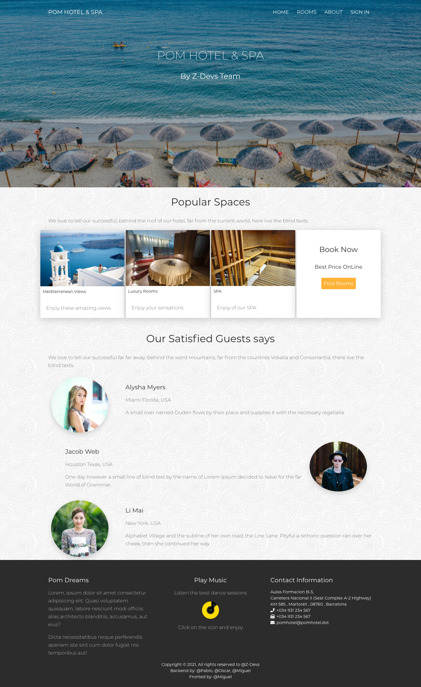
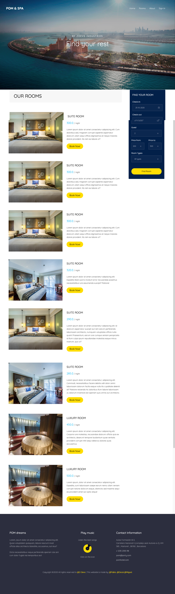
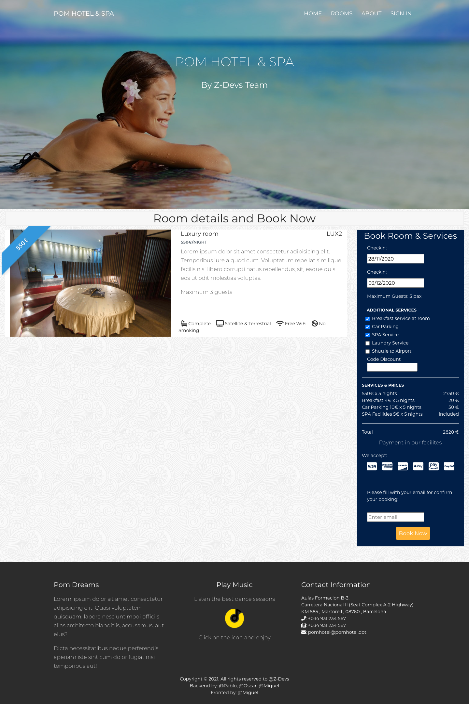
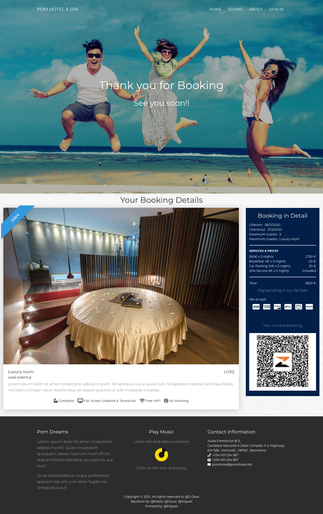

# Pom Hotel

Proyecto final practico realizado entre los dias 28/10/2020 al 16/11/2020 en las instalacion de Seat:Code durante la realizacion del bootcamp de GeeksHubs Academy para Seat:Code.  
El objetivo es practicar con los lenguajes, herramientas y conceptos de programacion instruidos por los profesores de GeeksHubs.

Sign in page:  

Home page:  

Rooms page:

Booking page:  

Confirmation page:  

<!--

-->
---
<!-- Pit i Collons -->

<!-- Regalito https://www.youtube.com/watch?v=Y6A_Czw8TFU -->

