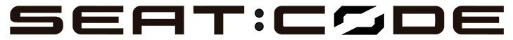

# Pom Hotel

Ejercicio practico realizado entre los dias 17/09/2029 al 2/10/2020 en las instalacion de Seat S.A. durante la realizacion del bootcamp de GeeksHubs Academy para Seat:Code.  
El objetivo es practicar con los lenguajes, herramientas y conceptos de programacion instruidos por los profesores de GeeksHubs.

<!--

-->
---

<!-- Regalito https://www.youtube.com/watch?v=Y6A_Czw8TFU -->

